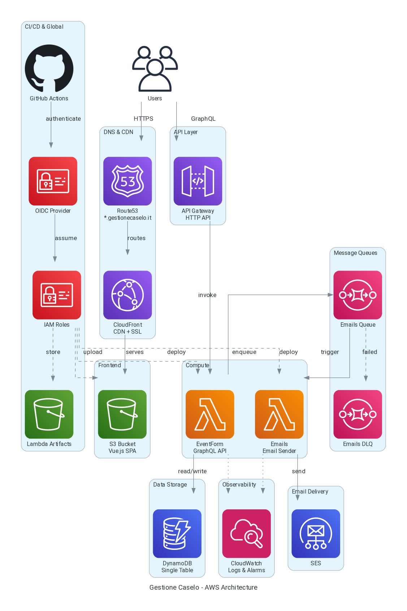

# Terraform Infrastructure

Infrastructure as Code for Gestione Caselo.

## Architecture Overview



### Regenerate Diagram

To update the diagram after infrastructure changes:

```bash
cd terraform
.venv/bin/python generate_diagram.py
```

The diagram shows:

- **Frontend**: Route53 → CloudFront → S3 (Vue.js SPA)
- **API**: API Gateway → EventForm Lambda → DynamoDB
- **Email Processing**: EventForm → SQS Queue → Emails Lambda → SES
- **CI/CD**: GitHub Actions → OIDC → IAM → Lambda/S3 deployments
- **Observability**: CloudWatch logs and alarms

## Deployment Strategy

**Infrastructure is deployed manually.** Application code (Lambda, frontend) deploys via GitHub Actions.

## Directory Structure

```text
terraform/
├── tf.sh            # Wrapper script for managing state deployments
├── .env             # Environment configuration (STATE_BUCKET, PROJECT_NAME)
├── .env.example     # Template for .env
├── modules/
│   └── shared/      # Reusable shared module (prefix, tags, etc.)
├── states/          # Per-state Terraform configurations
│   ├── global/      # OIDC provider, IAM roles, budget (one-time, no environment)
│   ├── route53/     # Hosted zones (per environment)
│   ├── cloudfront/  # CloudFront distributions, S3 buckets, certificates (per environment)
│   ├── cloudwatch/  # CloudWatch log groups and alarms (per environment)
│   ├── lambda/      # Lambda functions, IAM roles, SQS queues (per environment)
│   └── api_gateway/ # API Gateway resources (per environment)
└── tfvars/          # Environment-specific variable files
    ├── stage.tfvars
    └── prod.tfvars
```

## Initial Setup

### 1. Create State Bucket and Parameters

```bash
export TF_STATE_BUCKET="YOUR-STATE-BUCKET"

# Create state bucket with versioning, encryption, and block public access
aws s3 mb s3://$TF_STATE_BUCKET --region eu-south-1
aws s3api put-bucket-versioning --bucket $TF_STATE_BUCKET --versioning-configuration Status=Enabled
aws s3api put-bucket-encryption --bucket $TF_STATE_BUCKET \
  --server-side-encryption-configuration '{"Rules":[{"ApplyServerSideEncryptionByDefault":{"SSEAlgorithm":"AES256"}}]}'
aws s3api put-public-access-block --bucket $TF_STATE_BUCKET \
  --public-access-block-configuration "BlockPublicAcls=true,IgnorePublicAcls=true,BlockPublicPolicy=true,RestrictPublicBuckets=true"

# Create Parameter Store value for budget alert email
aws ssm put-parameter \
  --name "/gestione-caselo/budget-email" \
  --value "YOUR-EMAIL@example.com" \
  --type "String" \
  --region eu-south-1
```

### 2. Configure Environment

Create `.env` from the example:

```bash
cd terraform
cp .env.example .env
# Edit .env and set:
# STATE_BUCKET=YOUR-STATE-BUCKET
# PROJECT_NAME=gestione-caselo
```

### 3. Deploy Infrastructure

Use `tf.sh` wrapper to deploy states. Deploy in this order:

**Global (one-time, no environment):**

```bash
./tf.sh global init
./tf.sh global plan
./tf.sh global apply
```

**Any other state (per environment):**

```bash
./tf.sh {route53|cloudfront|lambda|cloudwatch|...} {stage|prod} init
./tf.sh {route53|cloudfront|lambda|cloudwatch|...} {stage|prod} plan
./tf.sh {route53|cloudfront|lambda|cloudwatch|...} {stage|prod} apply
```

`./tf.sh` is a wrapper that works with most Terraform commands.

## Naming Convention

Resources use: `${local.prefix}-[resource]` where:

- Global: `prefix = "gestione-caselo-global"`
- Per-env: `prefix = "gestione-caselo-{environment}"`

## Dependencies Between States

Deploy states in this order due to data source dependencies:

1. **global** - No dependencies
2. **route53** - No dependencies (reads global via data source)
3. **cloudfront** - Depends on route53 (hosted zone ID)
4. **cloudwatch** - No dependencies
5. **lambda** - No dependencies (but needs cloudwatch for logs)
6. **api_gateway** - Depends on lambda (function ARNs)
